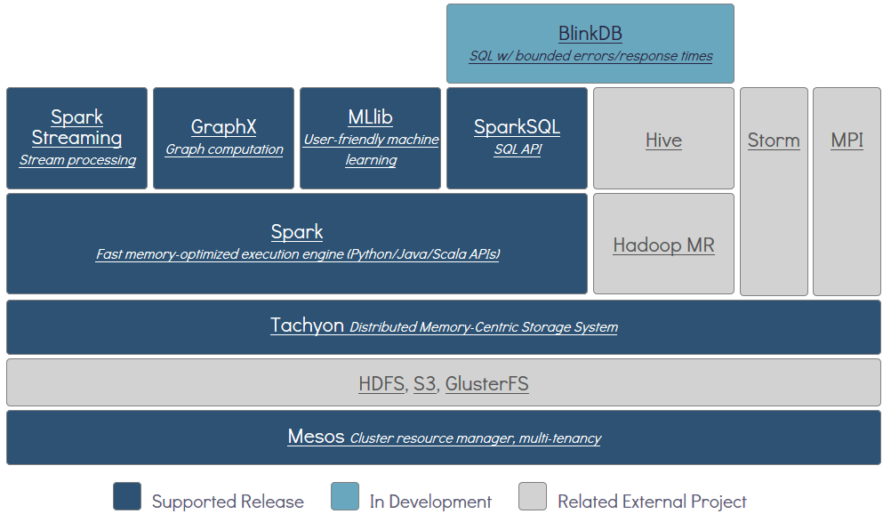

# tachyon源码

在通常的hadoop1 MapReduce作业（MR1 Job）中，数据必须经过一轮Mapper，一轮Reducer的处理过程，并将产出的结果写回到HDFS，其结果才能被下一轮的作业进一步使用和处理。在hadoop2 MapReduce作业中（MR2 Job）虽然支持DAG的计算作业，但数据在作业和作业之间的共享仍然需要经过HDFS进行中转。Apache Spark虽然可以对RDD进行cache，但也仅限于一个Spark Job之内，跨Job之间也无法很方便的共享cache在内存中的RDD数据。不仅如此，当作业的executor crash后，原本缓存在executor内存中的数据也随之丢失，需要重新计算。 如果有一个这样的分布式文件系统，它能够提供类似HDFS一样的分布式文件存储服务，同时还能够有内存级别的访问速度，那么就能很完美的解决上述碰到的问题。

Tachyon是一个开源的内存分布式存储系统，用来在分布式集群中提供高速的数据共享服务，其共享数据的速度比之通常的分布式文件系统要快很多倍。相当于内存访问跟持久化介质访问之间的性能差异。因此tachyon非常适合用来在不同的分布式计算框架（Apache Spark，Apache MapReduce，Apache Flink）的job内，以及job之间来共享数据。

在分布式大数据生态系统中，Tachyon处于各计算框架的计算作业（Spark，MapReduce，Flink等）和各种分布式存储系统（Amazon S3，OpenStack Swift，GlusterFS，HDFS，Ceph等）之间，为计算作业提供数据共享和数据缓存服务，能够极大的提高各种计算作业的效率和性能。

如下图所示，tachyon在开源大数据分析软件栈中，出于如下位置：

Tachyon目前具有如下一些功能：

* 灵活的文件系统API
* 可自定义的Under Storage支持
* 分层的缓存替换存储算法和机制
* 丰富的webui和command line工具
* 非常灵活的namespace mount机制
* 数据之间的lineage关系管理

 
## tachyon架构

