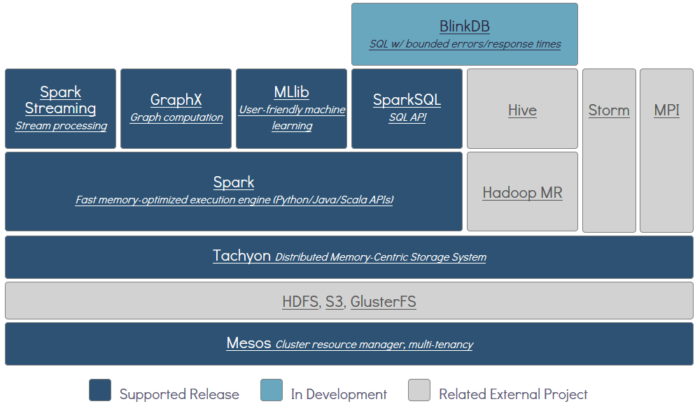
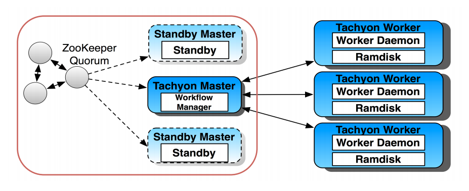

* [TachyonMaster](TachyonMaster/1.TachyonMaster整体架构.md)
  * [TachyonMaster RPC](TachyonMaster/2.TachyonMasterRPC.md)
  * [TachyonMaster Journal](TachyonMaster/3.TachyonMasterJournal.md)
  * [TachyonMaster FileSystemMaster](TachyonMaster/4.TachyonMasterFileSystemMaster.md)
  * [TachyonMaster BlockMaster](TachyonMaster/5.TachyonMasterBlockMaster.md)
  * [TachyonMaster RawTableMaster](TachyonMaster/6.TachyonMasterRawTableMaster.md)
  * [TachyonMaster LineageMaster](TachyonMaster/7.TachyonMasterLineageMaster.md)
  * [TachyonMaster MetricsSystem](TachyonMaster/8.TachyonMasterMetricsSystem.md)

# 我的tachyon源码笔记

在通常的hadoop1 MapReduce作业（MR1 Job）中，数据必须经过一轮Mapper，一轮Reducer的处理过程，并将产出的结果写回到HDFS，其结果才能被下一轮的作业进一步使用和处理。在hadoop2 MapReduce作业中（MR2 Job）虽然支持DAG的计算作业，但数据在作业和作业之间的共享仍然需要经过HDFS进行中转。Apache Spark虽然可以对RDD进行cache，但也仅限于一个Spark Job之内，跨Job之间也无法很方便的共享cache在内存中的RDD数据。不仅如此，当作业的executor crash后，原本缓存在executor内存中的数据也随之丢失，需要重新计算。 如果有一个这样的分布式文件系统，它能够提供类似HDFS一样的分布式文件存储服务，同时还能够有内存级别的访问速度，那么就能很完美的解决上述碰到的问题。

Tachyon是一个开源的内存分布式存储系统，用来在分布式集群中提供高速的数据共享服务，其共享数据的速度比之通常的分布式文件系统要快很多倍。相当于内存访问跟持久化介质访问之间的性能差异。因此tachyon非常适合用来在不同的分布式计算框架（Apache Spark，Apache MapReduce，Apache Flink）的job内，以及job之间来共享数据。

在分布式大数据生态系统中，Tachyon处于各计算框架的计算作业（Spark，MapReduce，Flink等）和各种分布式存储系统（Amazon S3，OpenStack Swift，GlusterFS，HDFS，Ceph等）之间，为计算作业提供数据共享和数据缓存服务，能够极大的提高各种计算作业的效率和性能。

如下图所示，tachyon在开源大数据分析软件栈中，出于如下位置：

Tachyon目前具有如下一些功能：

* 灵活的文件系统API
* 可自定义的Under Storage支持
* 分层的缓存替换存储算法和机制
* 丰富的webui和command line工具
* 非常灵活的namespace mount机制
* 数据之间的lineage关系管理

 
## tachyon架构

tachyon的整体架构如下图所示（示意图出处：[tachyon创始人浩源的分享](http://www.slideshare.net/TachyonNexus/tachyon-an-open-source-memorycentric-distributed-storage-system?qid=366df791-4d4e-45f4-a803-43dc306ad7f5&v=default&b=&from_search=4) ）

从tachyon整体架构图上可以看出，tachyon是一个分布式的文件系统，由Tachyon Master和Tachyon Worker组成一种主从结构，一个tachyon集群由一个master和一组worker组成。其中master负责管理文件系统中所有文件的metadata，提供Client所有的rpc访问结构响应，以及对文件系统metadata进行WAl log的持久化管理（checkpoint，journal），以方便集群重启后能够恢复到重启前的状态。而Tachyon Worker则负责将所有tachyon文件系统中的文件切块（Block）在worker内存中进行缓存，并向master汇报所有block的状态和原信息，以及worker本身的心跳信息。

由于Tachyon Master管理了所有的namespace和block的原信息，因此这个节点就非常重要，一旦crash，会导致整个文件系统不可用，因此，如上如所示，Tachyon为了提高整个系统的可用性，提供了多master的机制，多个master通过zookeeper上的节点进行选举，抢到zk lock的master作为leader master进行服务，其余的master进程则进入到standby状态，等待zk lock释放后再次进行选举。这样当一个master宕机后，会有其他master机器快速的进行候补，以确保服务尽量的高可用。当然，standby和master之间需要进行editlog（journal）同步，standby需要不停的tail master上的journal，然后replay到standby上，才能确保其状态跟active master同步。详细机制后续补充。

从以上整体架构来看，可以发现Tachyon架构跟hadoop HDFS的架构非常相似（hadoop从0.20.x版本开始支持Backup namenode，从2.0.x开始支持namenode HA），所不同的是，tachyon worker上优先将数据block cache在内存中，并提供多层tier的存储刷新替换机制。同时tachyon master还支持mount和lineage等更高级的机制，这些后面详细记录。 
