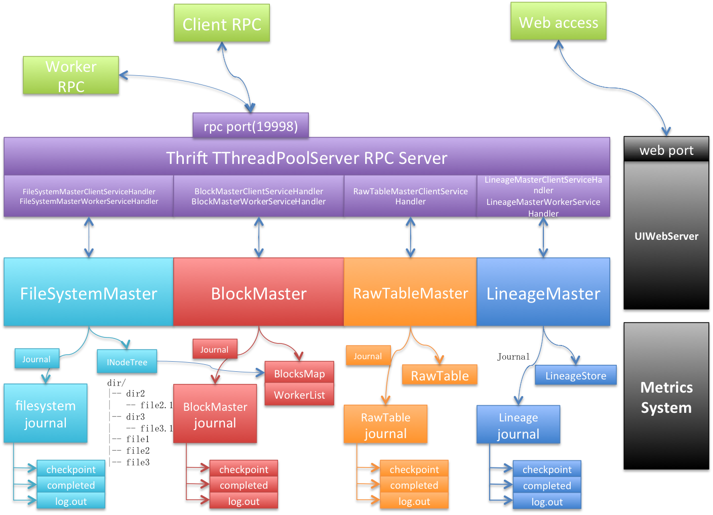

#TachyonMaster整体架构

从tachyon整体架构中可以看出，Tachyon Master是Tachyon整个文件系统中最关键的节点，这个角色负责整个文件系统所有文件和目录，以及数据block的原信息（Metadata）的管理和操作，概括来说，Tachyon Master负责以下工作：

* 管理整个文件系统的namespace，其中包括整个目录树结构，所有的目录和文件的Metadata
* 管理Tachyon中所有文件的Block Metadata，包括所有的block的id，大小，block所在的位置（worker），以及这些block在哪些worker的哪些存储层（Tachyon从0.6.0开始逐渐引入了存储分层的feature，worker部分会有详细笔记）上。
* 除了文件，目录，Tachyon还支持一种叫RawTable的存储样式，Tachyon Master还负责管理所有RawTable的metadata
* 管理所有文件的相互依赖metadata
* 将以上所有的Metadata按照特定的格式进行journal记录，定时做checkpoint，以便重启Tachyon集群时能够恢复状态
* 定期接收所有worker的心跳汇报，并根据心跳汇报更新master内存状态，并记录journal
* 接收并响应来自Client端的rpc请求，比如mkdir，createfile，delete等
* 提供一个webui server，供用户可视的观察文件系统的各种情况
* 提供一套metrics system，记录下对tachyon文件系统的各种访问统计信息

虽然要完成这么多的事情，但tachyon master的内部代码设计其实一点都不复杂，整理的非常规整。整理来看，Tachyon Master的架构如下图所示：

从master架构图上可以看出，tachyon master这样分成8大功能模块，分别是：

* RPC Server：负责接收来自Client和Worker的rpc相应请求。Tachyon的RPC框架使用的是Thrift。
* FileSystem：由FileSystemMaster类来进行管理，负责管理整个文件系统的namespace。
* Block：由BlockMaster类来进行管理，负责所有Tachyon File的block信息的管理。同时BlockMaster还负责管理所有注册到master的worker跟踪和管理。
* RawTable：由RawTableMaster类进行管理，负责管理所有RawTable的原信息
* Lineage：由LineageMaster类进行管理，负责一些有着前后依赖关系的文件DAG图信息的管理。
* Journal：以上几个xxMaster都分别对应有自己的journal Context，会把对相关信息的更新和状态记录的journal日志系统中去，以便集群重启后能够从这些journal log恢复状态。同时每个journal context都会定期进行checkpoint，相当于对这些metadata定期进行snapshot的保存。
* MetricsSystem：记录对tachyon文件系统的各种访问统计信息
* webui server：tachyon master的webui httpserver

以上每个模块都有其内部结构和对外接口，以下分别记录各个模块的一些实现细节：

* [TachyonMaster](1.TachyonMaster整体架构.md)
* [TachyonMaster RPC](2.TachyonMasterRPC.md)
* [TachyonMaster Journal](3.TachyonMasterJournal.md)
* [TachyonMaster FileSystemMaster](4.TachyonMasterFileSystemMaster.md)
* [TachyonMaster BlockMaster](5.TachyonMasterBlockMaster.md)
* [TachyonMaster RawTableMaster](6.TachyonMasterRawTableMaster.md)
* [TachyonMaster LineageMaster](7.TachyonMasterLineageMaster.md)
* [TachyonMaster MetricsSystem](8.TachyonMasterMetricsSystem.md)
