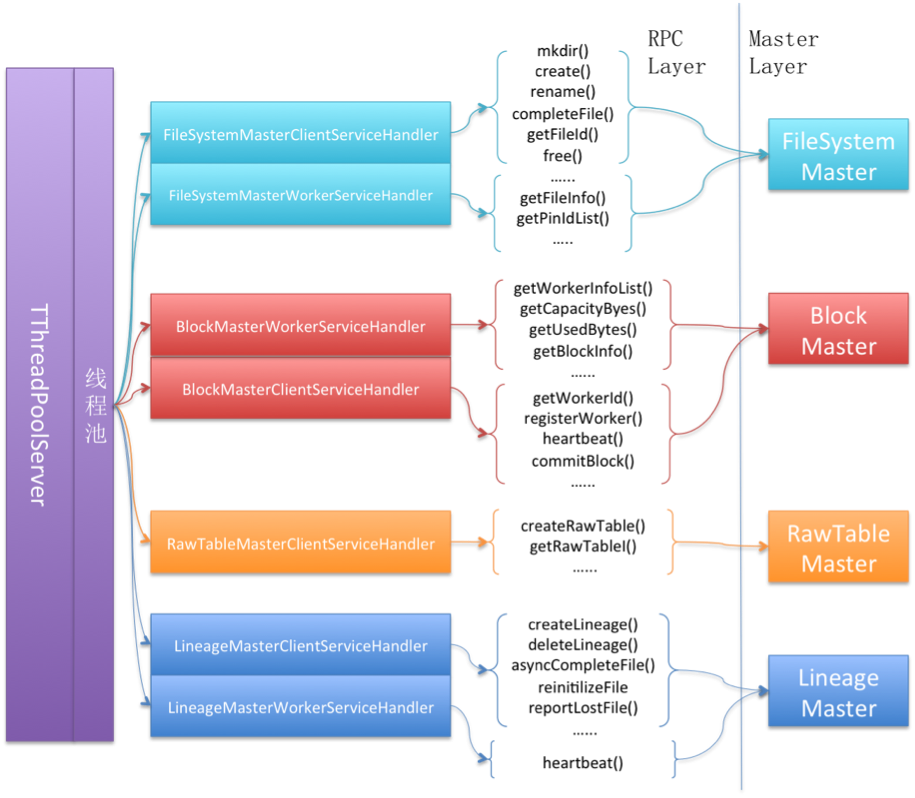

#TachyonMaster的RPC架构

Tachyon的RPC框架使用的是facebook贡献给apache基金会的Thrift框架，因此在tachyon的代码中，能够看到很多由thrift生成的一些rpc相关的代码，分别整理在如下 [tachyon.thrift](https://github.com/amplab/tachyon/tree/master/common/src/main/java/tachyon/thrift) 这个pachage中。所以要了解Tachyon的RPC详细架构，需要对 [thrift](http://thrift.apache.org) 有一个基本的了解。

在 [TachyonMaster整体架构](TachyonMaster整体架构.md) 这份笔记中，记录了tachyon的整体架构图，如下图所示：


## 服务接口定义示例

上图中，紫色的部分即为Tachyon Master中RPC的部分。Tachyon Master将各个功能模块的rpc响应组件划分的非常清晰，特定的RPC Service服务特定的RPC client的请求。在thrift中，一套特定的rpc接口由一个service来进行定义（定义在.thrift文件中），针对这套service中的接口，thrift会生成响应的server端代码和client端代码。例如，文件系统namespace相关的service，由如下.thrift说明定义：

```java
service FileSystemMasterClientService extends common.TachyonService {

  /**
   * Marks a file as completed.
   */
  void completeFile( /** the id of the file */ 1: i64 fileId,
      /** the method options */ 2: CompleteFileTOptions options)
    throws (1: exception.TachyonTException e)

  /**
   * Creates a file and returns the id of the file.
   */
  i64 create( /** the path of the file */ 1: string path,
      /** the options for completing the file */ 2: CreateTOptions options)
    throws (1: exception.TachyonTException e, 2: exception.ThriftIOException ioe)

  /**
   * Frees the given file from Tachyon and returns whether the free operation succeeded.
   */
  bool free( /** the id of the file */ 1: i64 fileId,
      /** whether to free recursively */ 2: bool recursive)
    throws (1: exception.TachyonTException e)

  /**
   * Returns the file block information for the given file and file block index.
   */
  common.FileBlockInfo getFileBlockInfo( /** the id of the file */ 1: i64 fileId,
      /** the index of the file block */ 2: i32 fileBlockIndex)
    throws (1: exception.TachyonTException e)

  /**
   * Returns the list of file blocks information for the given file.
   */
  list<common.FileBlockInfo> getFileBlockInfoList( /** the id of the file */ 1: i64 fileId)
    throws (1: exception.TachyonTException e)

  /**
   * Returns the file id for the given path.
   */
  i64 getFileId( /** the path of the file */ 1: string path)

  /**
   * Returns the file information.
   */
  FileInfo getFileInfo( /** the id of the file */ 1: i64 fileId)
    throws (1: exception.TachyonTException e)

  /**
   * If the id points to a file, the method returns a singleton with its file information.
   * If the id points to a directory, the method returns a list with file information for the
   * directory contents.
   */
  list<FileInfo> getFileInfoList( /** the id of the file */ 1: i64 fileId)
    throws (1: exception.TachyonTException e)

  /**
   * Generates a new block id for the given file.
   */
  i64 getNewBlockIdForFile( /** the id of the file */ 1: i64 fileId)
    throws (1: exception.TachyonTException e)

  /**
   * Returns the UFS address of the root mount point.
   */
  string getUfsAddress()

  /**
   * Loads metadata for the object identified by the given Tachyon path from UFS into Tachyon.
   */
  i64 loadMetadata( /** the path of the under file system */ 1: string ufsPath,
      /** whether to load meta data recursively */ 2: bool recursive)
    throws (1: exception.TachyonTException e, 2: exception.ThriftIOException ioe)

  /**
   * Creates a directory and returns whether the directory is created successfully.
   */
  bool mkdir( /** the path of the directory */ 1: string path,
      /** the method options */ 2: MkdirTOptions options)
    throws (1: exception.TachyonTException e, 2: exception.ThriftIOException ioe)

  /**
   * Creates a new "mount point", mounts the given UFS path in the Tachyon namespace at the given
   * path. The path should not exist and should not be nested under any existing mount point.
   */
  bool mount( /** the path of tachyon mount point */ 1: string tachyonPath,
      /** the path of the under file system */ 2: string ufsPath)
    throws (1: exception.TachyonTException e, 2: exception.ThriftIOException ioe)

  /**
   * Deletes a file or a directory and returns whether the remove operation succeeded.
   * NOTE: Unfortunately, the method cannot be called "delete" as that is a reserved Thrift keyword.
   */
  bool remove( /** the id of the file or directory */ 1: i64 id,
      /** whether to remove recursively */ 2: bool recursive)
    throws (1: exception.TachyonTException e)

  /**
   * Renames a file or a directory and returns whether the rename operation succeeded.
   */
  bool rename( /** the id of the file */ 1: i64 fileId,
      /** the desinationpath of the file */ 2: string dstPath)
    throws (1: exception.TachyonTException e, 2: exception.ThriftIOException ioe)

  /**
   * Sets file state.
   */
  void setState( /** the id of the file */ 1: i64 fileId,
       /** the method options */ 2: SetStateTOptions options)

  /**
   * Deletes an existing "mount point", voiding the Tachyon namespace at the given path. The path
   * should correspond to an existing mount point. Any files in its subtree that are backed by UFS
   * will be persisted before they are removed from the Tachyon namespace.
   */
  bool unmount( /** the path of the tachyon mount point */ 1: string tachyonPath)
    throws (1: exception.TachyonTException e, 2: exception.ThriftIOException ioe)
}

```

上述定义，就定义了namespace相关的service提供的接口，可以看出，这套接口中，提供了很多常用的文件系统接口，如 mkdir，remove，create，rename等等。因此，这个FileSystemMasterClientService就是文件系统namespace接口的定义模板。Tachyon Master提供的跟Client通信的文件系统namespace相关的接口列表既在此定义。

由于Tachyon Master不仅仅需要通过rpc跟client通信，同时还需要跟worker通信，因此，Tachyon Master还需要提供一套跟worker通信的rpc 接口列表，这套接口就定义在FileSystemWorkerClientService中。

## 多套服务接口

以上是拿文件系统namespace相关的接口为例，说明了一下tachyon中如何规划master与client，master与worker之间的接口定义。而在Tachyon Master中，并不仅仅只提供了namespace相关的接口，如上图所示，Tachyon Master有多套服务接口定义，整理如下：


<table>

<tr>
	<th>Service</th>
	<th>说明</th>
	<th>源码地址</th>
</tr>

<tr>
	<td>FileSystemMasterClientService</td>
	<td>定义Tachyon Master跟Tachyon Client（既tachyon文件系统的客户端）之间的namespace相关rpc接口</td>
	<td> <a href="https://github.com/amplab/tachyon/blob/master/common/src/thrift/file_system_master.thrift">源码</a> </td>
</tr>

<tr>
	<td>FileSystemMasterWorkerService</td>
	<td>定义Tachyon Master跟Tachyon Worker之间的namespace相关rpc接口</td>
	<td> <a href="https://github.com/amplab/tachyon/blob/master/common/src/thrift/file_system_master.thrift">源码</a> </td>
</tr>

<tr>
	<td>BlockMasterClientService</td>
	<td>由于tachyon类似HDFS，将文件进行切块分布式存储，因此文件会被划分成一个或多个block，分别存储在不同的worker上，该接口定义了Tachyon Master跟Tachyon Client之间的Block相关rpc接口</td>
	<td> <a href="https://github.com/amplab/tachyon/blob/master/common/src/thrift/block_master.thrift">源码</a> </td>
</tr>

<tr>
	<td>BlockMasterWorkerService</td>
	<td>Tachyon Master需要知道哪些block被存储在了哪些worker上，并通过定期的worker心跳来更新这些信息，这些是通过Master和worker之间的block相关的rpc接口来通信的。</td>
	<td> <a href="https://github.com/amplab/tachyon/blob/master/common/src/thrift/block_master.thrift">源码</a> </td>
</tr>

<tr>
	<td>RawTableMasterClientService</td>
	<td>Tachyon中不仅提供目录和文件视图，还通过特定的目录组织形式提供一种RawTable视图，提供给client进行RawTable视图的相关数据管理和存储，Master和Client之间关于RawTable相关的接口由RawTableMasterClientService定义</td>
	<td> <a href="https://github.com/amplab/tachyon/blob/master/common/src/thrift/raw_table_master.thrift">源码</a> </td>
</tr>

<tr>
	<td>LineageMasterClientService</td>
	<td>Tachyon允许用户定义文件跟文件之间的依赖关系图，相关的rpc接口定义在LineageMasterClientService中。</td>
	<td> <a href="https://github.com/amplab/tachyon/blob/master/common/src/thrift/lineage_master.thrift">源码</a> </td>
</tr>

<tr>
	<td>LineageMasterClientService</td>
	<td>Lineage相关的Master和Worker之间的rpc接口定义。</td>
	<td> <a href="https://github.com/amplab/tachyon/blob/master/common/src/thrift/lineage_master.thrift">源码</a> </td>
</tr>
</table>

## RPC内部细节架构

Tachyon通过相应的.thrift文件定义了各个组件对外提供的RPC接口，并通过thrift生成rpc框架代码。Tachyon中只需要实现这些Service对应的thrift Iface接口，并将处理各套接口的TProcessor（Thrift概念）注册到RPC Server即可。

Tachyon Master RPC框架内部示意图如下：



因此可以看出，Tachyon Master中，各个组件模块及其对应的rpc接口划分的非常清晰，为用户提供了非常清晰的rpc接口，从代码的管理上也非常规整。
