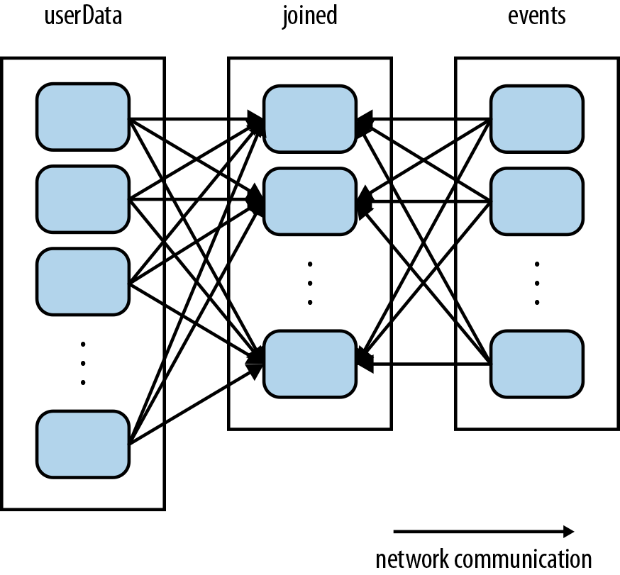
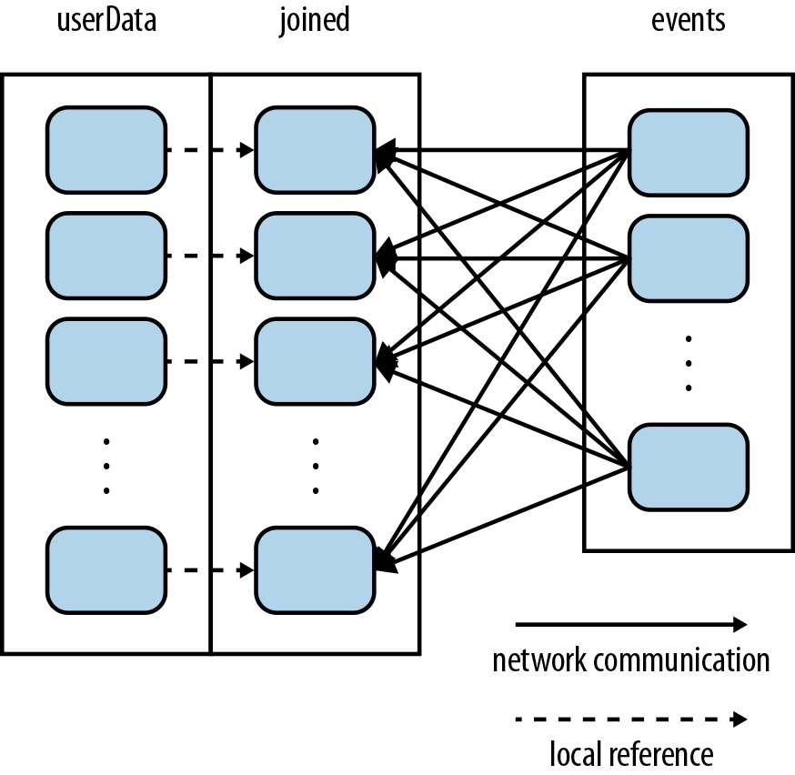

# 使用partitionBy函数优化性能

Spark中RDD中的数据是按照相应的partitioner算法分布在集群的各机器上的，而对这些数据进行计算的时候，将数据通过集群网络在集群各计算节点之间进行传输是一件非常消耗资源的事情。所以在实际运算中，通过对数据的分布和规划来减少数据在网络中的shuffle，将会大大的提高计算的效率。Spark程序可以通过控制RDD的partition方式来达到目的。当数据需要多次被使用，且是类似key-value操作时，这种优化效果就会比较明显。

Spark的partition优化对于所有的key-value类型的操作都有效。让spark对每个key进行特定的partition函数，来将相同的key group到一起。虽然spark并没有提供将某个key分不到某台计算节点的方式（因为集群中的计算节点都被认为是随时可能宕机的，所以绑定数据到特定的机器并不合理），但是却提供了让满足某一类条件的key分布到相同计算节点的方式。例如，用户可以对RDD进行100个分区的hash-partition，那么相同hash value%100的key就会分布到同一台机器；或者用户可以对RDD进行range-partition，那么出现在相同range中的key就能分布在相同的机器。

来看一个简单的例子：该application在内存中维持一份用户数据的表，其RDD结构为(UserID, UserInfo)对，UserInfo用来表示用户订阅的topics列表。该应用程序周期性的将该用户表跟一个小的订阅events数据表进行combine。假设该events数据表的结构为(UserID, LinkInfo)，其中LinkInfo表示用户在过去5分钟内点击的网站链接。如果我们需要统计过去5分钟用户点击了哪些不在其订阅列表中的网站链接，可以使用Spark的join()操作，将同一个用户的UserInfo和LinkInfo group到一起，然后进行统计。代码如下：

```scala
// Initialization code; we load the user info from a Hadoop SequenceFile on HDFS.
// This distributes elements of userData by the HDFS block where they are found,
// and doesn't provide Spark with any way of knowing in which partition a
// particular UserID is located.
val sc = new SparkContext(...)
val userData = sc.sequenceFile[UserID, UserInfo]("hdfs://...").persist()

// Function called periodically to process a logfile of events in the past 5 minutes;
// we assume that this is a SequenceFile containing (UserID, LinkInfo) pairs.
def processNewLogs(logFileName: String) {
  val events = sc.sequenceFile[UserID, LinkInfo](logFileName)
  val joined = userData.join(events)// RDD of (UserID, (UserInfo, LinkInfo)) pairs
  val offTopicVisits = joined.filter {
    case (userId, (userInfo, linkInfo)) => // Expand the tuple into its components
      !userInfo.topics.contains(linkInfo.topic)
  }.count()
  println("Number of visits to non-subscribed topics: " + offTopicVisits)
}
```

以上代码运行逻辑没有问题，但是并不高效。因为在每次processNewLogs()调用中，join()操作并不知道任何数据是如何按照keys的进行分布的partition信息。所以会按照默认的行为：将两个数据集都按照key进行hash partition，将相同hash值的key对应的数据shuffle到相同的机器，join到一起(如下图)。由于userData表通常比较大，而events表通常很小，这种操作行为就非常的低效。因为userData的数据需要每次都在集群中shuffle，而其并没有进行任何修改。



要解决这个问题非常简答，只需要在userData上使用partitionBy()函数，使用hash-partition算法对userData的数据进行一次partition，如下：

```scala
val sc = new SparkContext(...)
val userData = sc.sequenceFile[UserID, UserInfo]("hdfs://...")
                 .partitionBy(new HashPartitioner(100))   // Create 100 partitions
                 .persist()
```

其他的代码维持不变（由于events RDD是在processNewLogs()函数local变量，每次调用的时候只使用一次，所以对events进行partition没有任何帮助）。由于调用了partitionBy()，Spark就知道userData是进行了hash-partitioned的RDD，于是调用join()的时候，就会使用这个有用的信息。实际上，调用`userData.join(events)`时，Spark只会shuffle events RDD，将相应UserID的数据shuffle到对应UserID所在的userData partition所在的机器（如下图）。结果就是，节省了很多网络shuffle userData RDD的开销，效率得到了提高.




注意：partitionBy()是一个transformation，所以该调用始终会返回一个新的RDD，所以该操作并不会修改原来的RDD（Spark中RDD被创建之后是不能被修改的）。因此，对userData进行persist非常重要。另外，传给HashPartitioner的100参数，表示对该RDD进行多少个partition的分区，这将决定对该RDD的操作的parallel程度（有多少task在并行的处理该RDD的数据）。通常可以将该并行度设置为集群的最大core数。


不仅如此，事实上，Spark RDD的许多其他操作也会自动的使用已知partition的数据集的优势进行计算。比如sortByKey() 和 groupByKey()，分别产生range-partitioned 和 hash-partitioned的结果。另一方面，像map这种操作就无法保持原本的RDD partition分布，因为其产生的数据可能已经修改了key本身的值。